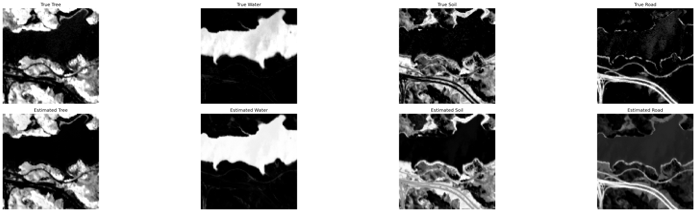

<!-- filepath: c:\Users\14704\VSCodeProjects\RemoteSensing\CNN\README.md -->
# 高光谱解混项目（基于深度卷积神经网络）

本项目实现了参考 Li 等人 2018 年 IEEE TGRS 论文的高光谱解混方法，采用深度卷积神经网络（CNN）和自编码器（Autoencoder）进行端元和丰度的估计，并支持 Jasper Ridge 和 Urban 两个经典高光谱数据集。

---

## 可视化示例

### 端元丰度分布可视化

下图展示了 Jasper Ridge 数据集上，4 个端元（Tree, Water, Soil, Road）真实丰度与模型估计丰度的灰度分布对比：

<p align="center">
  
</p>

### 训练过程与丰度拟合结果

左图为训练与验证损失曲线，右图为丰度拟合的散点对比（理想拟合为红色虚线）：

<p align="center">
  
</p>

---

## 目录结构

```
CNN/
├── data_loader.py            # 数据加载与预处理
├── model.py                  # 网络模型定义（CNN与Autoencoder）
├── train.py                  # 训练流程与早停
├── metrics.py                # 评估指标（RMSE/SAD/SRE等）
├── main.py                   # 主程序，训练/测试/可视化
├── visualize_abundance.py    # 丰度灰度分布可视化（单独脚本）
├── compare_abundance_visual.py # 真实与估计丰度分布对比可视化
├── README.md                 # 项目说明文档
└── data/                     # 数据集目录（需自行准备）
```

---

## 数据集准备

- **Jasper Ridge** 和 **Urban** 数据集需放置于 `./data/` 目录下，格式为 `.mat` 文件。
- 数据文件需包含：
  - `Y`：高光谱数据矩阵（shape: [bands, pixels] 或 [pixels, bands]，代码已适配）
  - `M`：端元矩阵
  - `A`：丰度矩阵（如有）

---

## 依赖环境

- Python >= 3.7
- torch >= 1.9.0
- numpy >= 1.19.0
- scipy >= 1.5.0
- scikit-learn >= 0.24.0
- matplotlib >= 3.3.0
- tqdm >= 4.50.0

安装依赖：
```bash
pip install torch numpy scipy scikit-learn matplotlib tqdm
```

---

## 使用方法

### 1. 训练与评估

在 `main.py` 中选择运行模式：

```python
mode = 'train'  # 训练模式
# mode = 'test'  # 测试模式（加载已训练模型 best_model.pth）
```

运行主程序：
```bash
python main.py
```

- 训练模式下，模型会自动保存为 `best_model.pth`。
- 测试模式下，直接加载 `best_model.pth` 进行评估。

### 2. 丰度分布可视化

训练/测试结束后，自动生成端元丰度的灰度分布图（`abundance_compare.png`），对比真实与估计丰度。

如需单独可视化，可运行：
```bash
python compare_abundance_visual.py
```

---

## 主要功能

- 支持 Jasper Ridge 和 Urban 数据集的高光谱解混
- CNN 与 Autoencoder 两种模型结构
- 丰度和端元估计
- 丰度分布灰度图可视化（支持端元命名：Tree, Water, Soil, Road）
- 评估指标：RMSE、SAD、SRE、Abundance RMSE
- 训练早停与学习率调度

---

## 参考文献

Li, S., Song, W., Fang, L., Chen, Y., Ghamisi, P., & Benediktsson, J. A. (2018).  
Deep learning for hyperspectral image classification: An overview.  
IEEE Transactions on Geoscience and Remote Sensing.

---

## 注意事项

- 数据集需自行准备并放置在 `./data/` 目录下。
- Jasper Ridge 数据集默认空间结构为 100x100。
- 端元顺序为：Tree, Water, Soil, Road。
- 若需自定义模型结构，可修改 `model.py`。
- 训练过程中如遇 GPU 内存不足，可适当调整 batch_size。

---

## 联系与反馈

如有问题或建议，请通过 GitHub Issues 反馈。